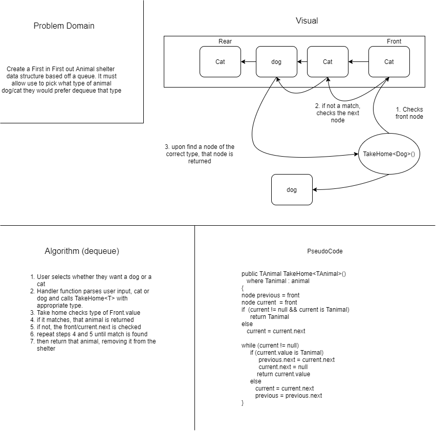

# Animal Shelter

**Summary** The concept behind this application is to create an Animal Shelter data structure that 
operates on FIFO principles like a queue. The animal shelter contains two derived objects, 
dogs and cats. Unlike a queue, the user needs to able to specify what kind of animal they would 
prefer, cat or dog, and then the method would have to select the animal of that type that has been
in the there longest, not simply the front empty in the queue. The method does have the function 
to select the first animal in the queue if the user has no preference.

**WhiteBoard**

**Approach** 
 This application takes advanate of generic types, abstract and derivded classes, and casting 
 to create the desired behavior

 **Methods**
 - ArriveAtShelter<TAnimal>(value) - accepts input of an animal derived class and places them in the shelter
 - TakeHomeWhich<TAnimal>(selection) - a handler function, takes in user input of type of animal
 "dog", "cat", or "either." Then calls the TakeHome method with the specified type parameter. If user
 enters "either",  TakeHome will grab the animal at the front of the queue.
 - TakeHome<Tanimal>() - Selects an animal of the selected type parameter that is closest to the front