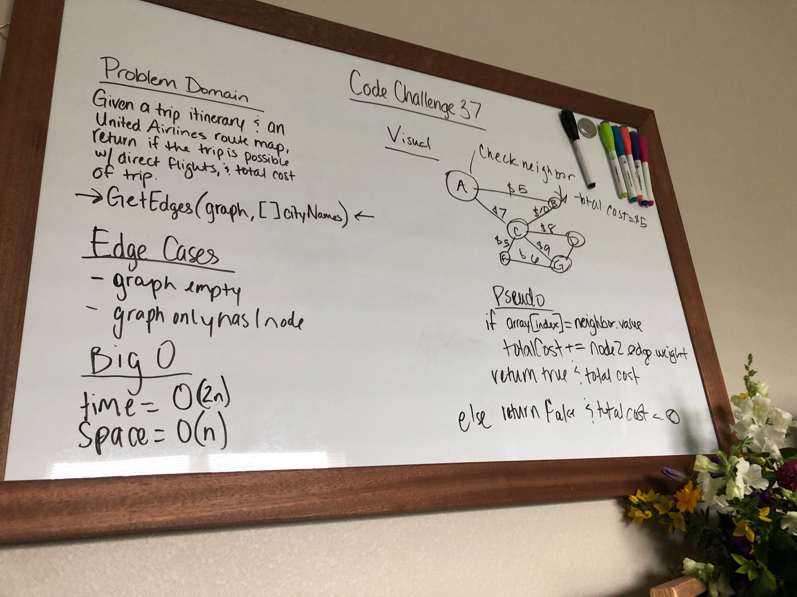

# Graph Challenges

- Plane Trip
  - Challenge: create method that determines if a there is path between two vertices and if there is 
  return both the bool and sum of weights of the connecting edges.

  
