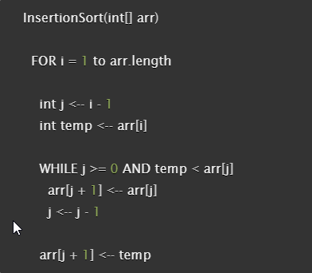

# Insertion Sort

  Starting off our Week of Sorting is the Insertion Sort. While far from efficient, this method does have a 
  a simple elegance that can make it easier to other understand than other sorting algorithms. In a abstract sense, it breaks the array
  into the a sorted array and non sorted array. The first item in the sorted array is simply the first element. As it 
  is the only element, it is sorted! The method checks the second item, if it is less than the first, they swap places. 
  If not, they do not. Now we have two items in our sorted partition of the array. This continues on through out the entire 
  array.

   Let us introduce the pseudocode algortihm and break it down. 

   

   The for loop is what traveses the entire array. So even if the array is already sorted, InsertSort will have a bigO of n, 
   otherwise it will be n^2.
   
   Then the index j is set to one less than and a we create a temp variable with a value of the element at i.

   Next, we have the while loop that does actual sorting and shifting around of elements, notice that since intial value of
   j is -1, the while loop will not run for the first element. This the seed element of our sorted partition.  Starting with
   the second element, the while loop conditional will compare the current element and the previous one. If the current is less
   than the previous, the two will swap places. This process will continue down the line until it finds an element less than current
   element or it reaches the end of list.

   Once you have reached then of the for loop, you have a sorted array!
