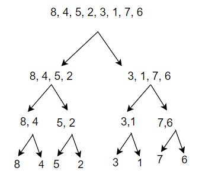

 For the second sort, we have the Merge Sort!. While is more efficient than Insertion Sort, it is 
more complicated, and includes the dreaded word *recursion*. This refers to a method calling itself inside 
of itself. See not confusing at all! More on that later. The Merge Sort is essentially Divide and Conquer.
The basic principle is that you divide the array again and again, recursively, until you have each element 
by their lonesome. Then you Conquer(Sort) and merge them back together into one neat array. 

To try to make this easier to understand let divide the Divide and Conquer.

**Divide**

This is the first half of the algorithm than makes up the MergeSort Method. As implied by the section title, 
this half is all about breaking down the array. It first splits the array into two halves. 

And then here we have the recursion. After the split, the method calls itself on each half. It will continue 
splitting and calling itself until it can split no more. 

The neat thing about an array of one element? It is already sorted! That means when can begin conquering with our 
*eight* sorted arrays.

**Conquer**

Conquering is all about the Merge method. As it merges, it also sorts! It takes two of the numbers, determines which 
one is less and fills and array of two in a neatly sorted manner. 

After the intial merge, the method compares the first element of each array to determine what to add to next array.
Then it continues adding the elements in order. For example if the first element of the left side is less then the first
 element of the right side, it will add the left first one. Then it will compare the right first element to the left 
 *second* element. It will add and continue in this fashion until everything is merged.

 

 If one side is short than other, or if one side is all less than the first element of the right side, merge will finish 
 by adding all that is left of the non-empy side. This is meaning of the last two lines of the algorithm.  

 And now you have a sorted Array!

 **The complete picture**

  

