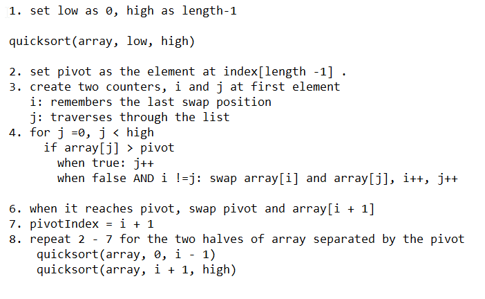

# The Quick Sort

Today, in the Week of Sorts, we have the Quick Sort! This takes idea of divide and conquer from the merge sort,
and applies it just a little differently. First, it picks an element of the array to be the *pivot*. This will be the
dividing line to help us conquer a messy array. Every element that is less than the pivot is shifted to left of
it, while every element that is greater is shifted to the right of it. This means that the pivot element is now 
conquered (sorted), into its correct place in the array! One Down, n - 1 to go!

This process is repeated recursively for each half divided by the pivot. Each one also picks a new pivot.

The pivot is the key to the whole thing, especially for the efficiency. The Quick Sort will always be better for space 
than the Merge Sort, since it alters the array in place without creating copies of each new half. For the time
efficiency, however, it depends largely on the pivot chosen. The ideal choice is that the pivot is always the median value.
This balances out the process nicely, leading to a Big O of (nLogn). The worst case is if the pivot is always 
the largest or smallest element. This will result in a Big O of (n^2). Not ideal.

There are many different ways to pick the pivot, how effective they are depends on the array. A simple technique
is to have the pivot always be the last element in the array/partition. To make the code and algorithm a little 
simpler, this is what I will use today.

Let's get started!

Here is a pseudocode/algorithm to look over. 

The method begins by setting the lower and upper bounds, in the intial call it will be zero and the length of 
array minus one. After this it creates two counters, i and j, and a for loop to travese over the whole array using 
the j counter. The i counter is a kind of pointer keeping track of the last position where it swapped elements. 

Then it begins comparing each element to the pivot. If the element is less than the pivot then
it swaps the element at i with the element at j. Then it increments *both* counters

if the element is greater than the pivot then there is no swapping and *only* j increases. 

This continues for each element until it hits the upper bound. When it does exit the for loop, it swaps the pivot
with the element at index (i + 1). This is the first element that is larger than the pivot. 

Look! the number 35 is exactly where it should be. Consider it conquered...sorted. Everything in A is less than 35, 
and everything in B is greater. One of the neat things about the Quick sort, is that now nothing in A will ever need
to be compared with anything B. Maybe you can consider them partially conquered?

Using recursion, the process is than repeated for both A and B. The upper bound to be used in the for loop for  A
is the index of the previous pivot. For B, the lower bound is the index of the previous pivot minus one. All the 
minuses and plusses can be tricky, I mean fun, to keep track of.

Once the sort runs the all the dividing and conquering, you will a beautifully sorted array. Enjoy!

Here is the full picture for the intial iteration:

