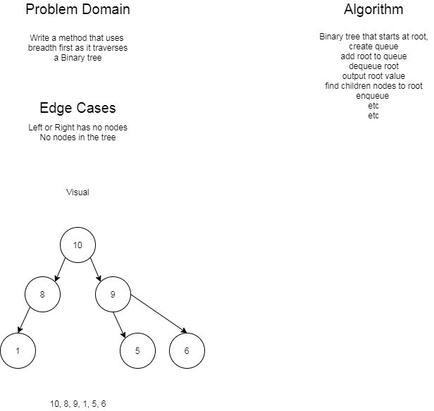

# Binary Tree

- Today we have a fun data structure, the tree. The structure starts with a single node, the Root. 
The node has references to children node, Two in the case a Binary Tree, a left and a right. Each child
has its own children all the way down the tree.
  - A specialized version is the Binary Search Tree. In this tree, when a node is added, if it is has
  a greater value than the current, it checks the right child for an empty reference. If it is less, it checks the
  left reference. It will keep going until it finda an empty spot and fils it. A binary Search Tree, similar to 
  a binary search, is handy because it has a big O (log n)

- **Methods**
    - Binary Tree
      - DepthHandler(choice): the user selects which depth first traversal method the user wants, the method calls 
      the approriate method, it then returns an integer array.
        - PreOrder()
        - InOrder()
        - PostOrder
      - Breadth(): completes a breadth first traversal and returns a list on integers
      - FindMaxValue(): uses a pre-order traversal to find the max value in a tree
    - Binary Search Tree
      - Add(value): adds the value according the BST rules
      - Contains(value): examines the tree to determine if it contains the value and returns a boolean

- WhiteBoards:

  - Breadth WhiteBoard

  

  - Find Max Value

  