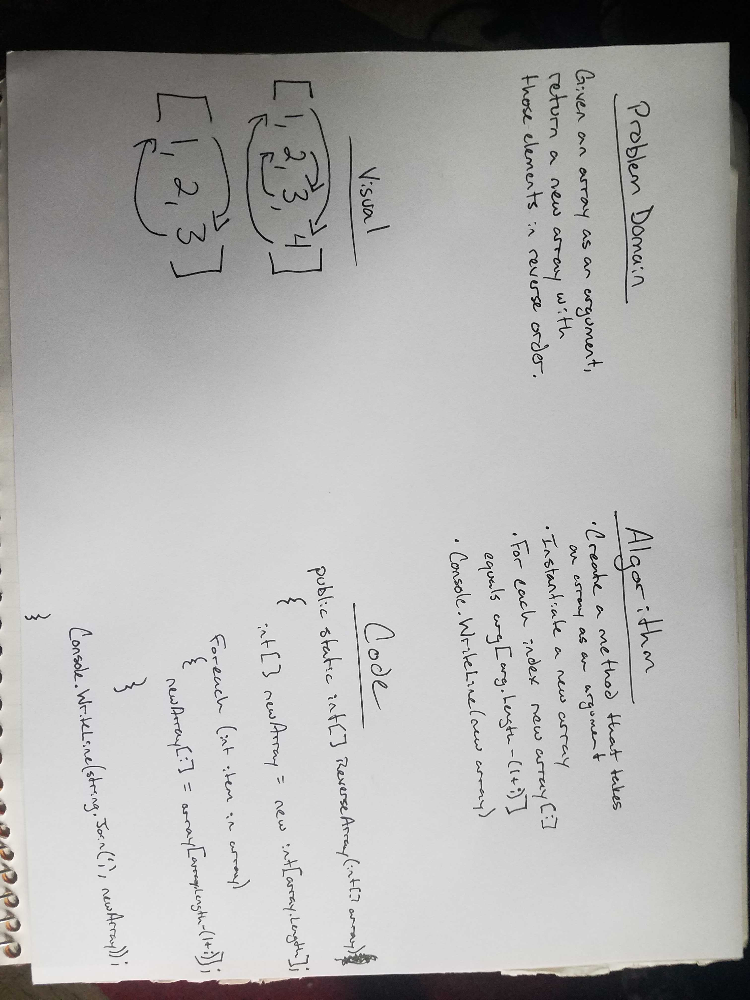
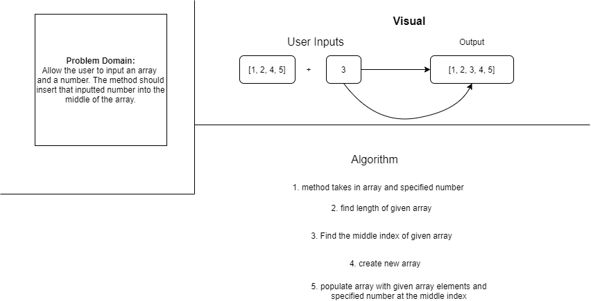
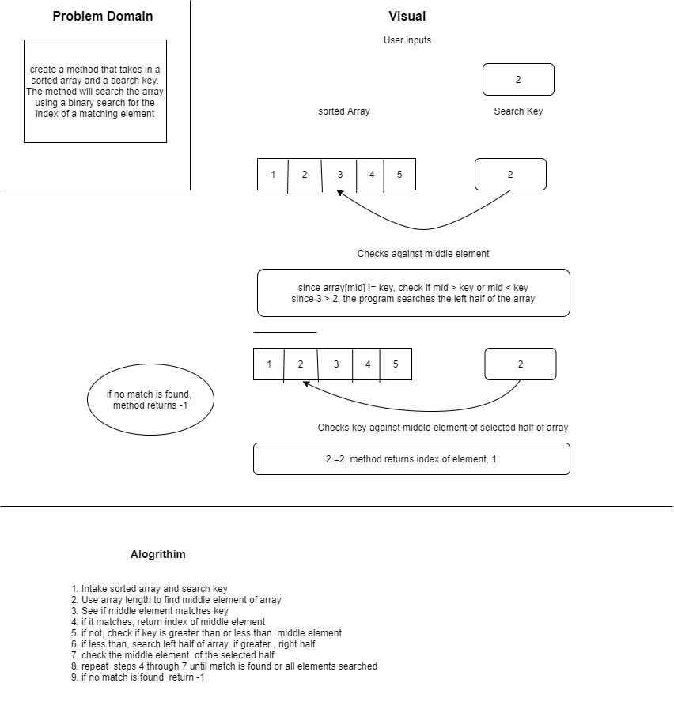
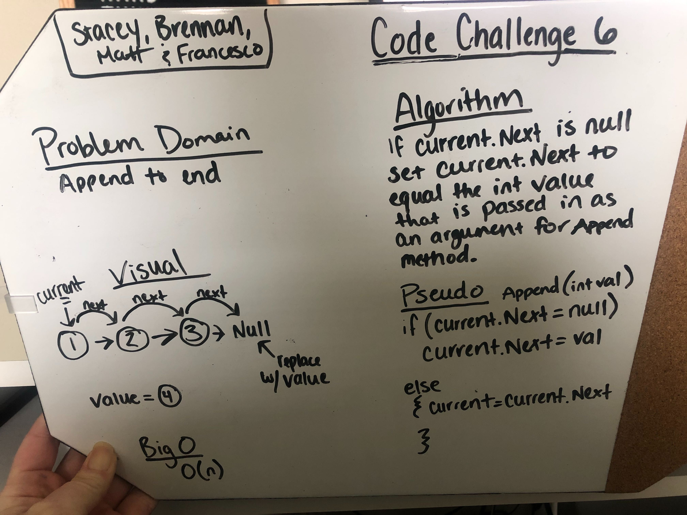
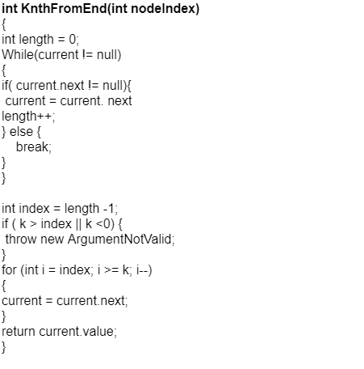
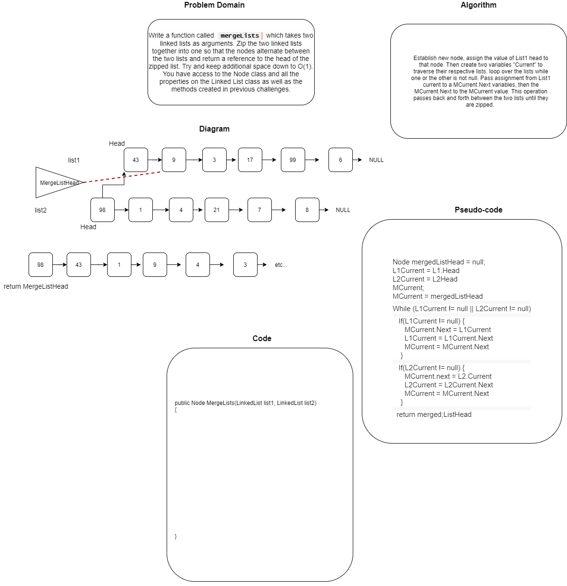
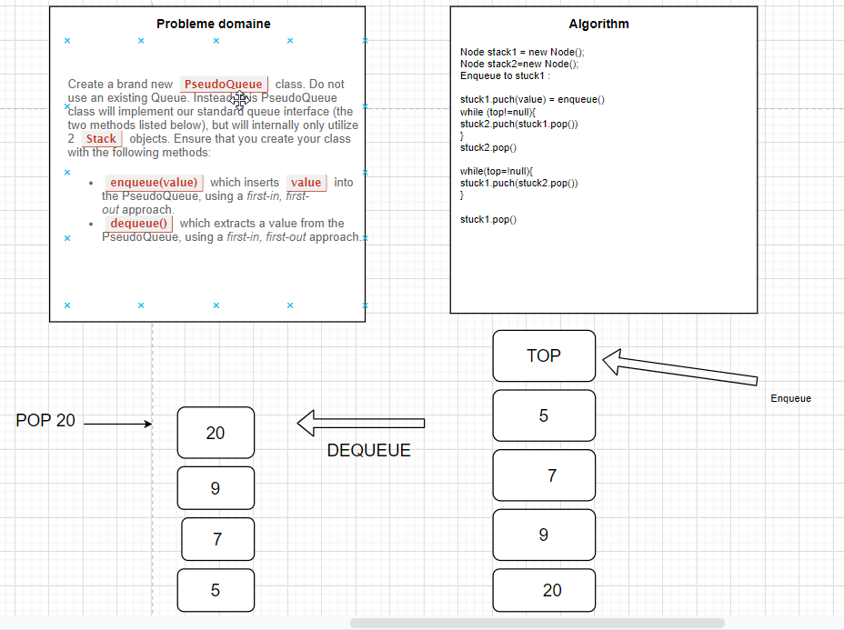
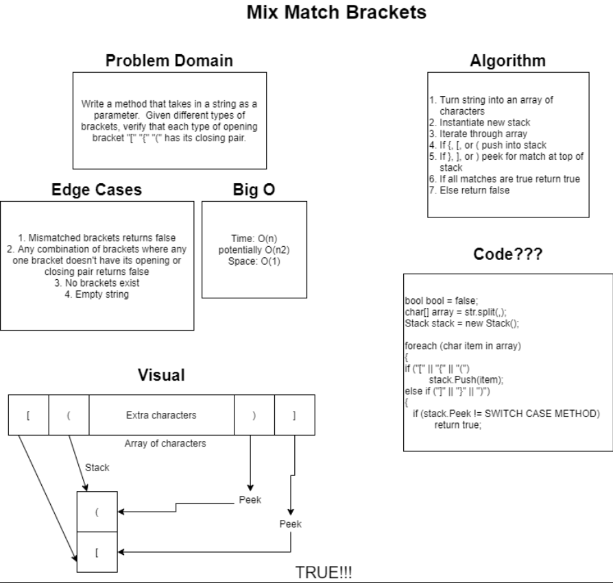

# 401-DSA
## data structures and algorithms challenges for code 401

- **Challenge 1: Reverse an array**
  - 
- **Challenge 2: Insert number into middle of array**
  - 
- **Challenge 3: Binary Search**
  - 
  - **Challenge 5: Linked Lists**
    *Approach*: Beyond simple arrays and variables, there are many different data structures to use as ways to store data. 
      The data structure for this challenge is the Linked List. It is chain of nodes with values that each contain a reference to the next 
      node/link in the chain. 

      *Challenge*: The goal day was to creating a linked list class, allowing for the creation of linked list objects. The class includes 
      methods to insert new nodes, search existing nodes for a given value, and to convert the list to a string. With Test Driven Development 
      in mind we also had to create corresponding xunit test to ensure the program is running smoothly;

      *Methods*
       - LinkedLists(): creates a new empty linked list object.
       - Insert(): adds a new node with an inputted value to the beginning of the list.
       - Includes(): searches the list for an inputted value and returns true if found and false if not.
       - ToString(): provides a string interperation of the entire linked list

  - **Challenge 6: Linked List insertions**

 - 

    *Approach* Builds off the previous challenge to allow the user more ways add values to the Linke List

    *Challenge* The big challenge today was changing were they could insert the new node. In challenge 5
    they only place the user could add a new value is at the top of the list. Now they can add a value to 
    the end of the list, and before or after and given value.

     *Methods*
      - AppendToEnd(): Added a value to the end of the list
      - InsertBefore(): searches the list for a given value, and if it exists, adds the new value before it
      - InsertAfter(): searches the list for a given value, and if it exists, adds the new value after it

- **Challenge 7: Linked Lists - Knth from the end**

    *Approach* Todays Challenge is create a method where the user inputs a index number and the method returns
    the value of the node at that index, counting from the end ie the last node is as index 0;
    
    *Challenge* the KnthFromEnd method works by first cycling through the list to establish its length. It 
    then uses the length and inputted index number to move to the correct node.

    *Method*
    - KnthFromTheEnd(): searches the list for a node at a particular index and returns the value of that node

- **Challenge 8: Linked Lists - Merging Lists**

    *Approach* Today's challenge is to create a method to merge two linked lists together.
    To merge properly the resulting list should alternative from a node of one list to the a 
    node of the other

    *Method*
    - mergeLists(): merge two linked lists together

- ** Chalenge 11: PseudoQueue**

     *Approach* This challenge was to make a queue without making a queue. Instead
     this pseudoqueue uses two stacks. The values are juggled between the two stacks
     to alternative between the front/top and rear/bottom values. It is hard to grasp
     at first

     *Methods*
     - Enqueue(value): adds value to the rear of the pseudoqueue
     - Dequeue(): removes the node from the from of the pseudoqueue and returns its
     value

- **Challenge 13: Multi Bracket Validation**

    *Approach*: The goal today was to have method that when given a string, would validate
    whether the expressions has the proper number and format of brackets
    IE: "{()[]}" returns true, "[}](" returns false.
    Out method uses a stack for storage and goes through the string using a foreach

    *Methods*
    - MultiBracketValidation(string input): checks if the bracket format is correct and returns
    a boolean

    - FindMatch(char input): Given a closing bracket, this method finds the open bracket that 
    matches